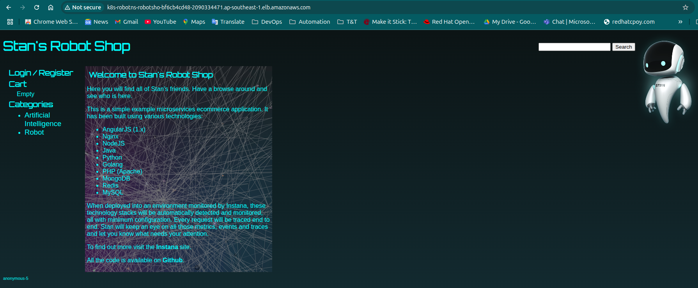

# EKS Infrastructure with Terraform

This repository contains Terraform code for provisioning an Amazon Elastic Kubernetes Service (EKS) cluster with support for stateful microservices and ingress policies. It automates the setup of an EKS cluster, VPC, IAM roles, and Kubernetes service accounts, enabling secure and scalable Kubernetes deployments on AWS.

# Features

- **EKS Cluster: Provisions a managed EKS cluster using the terraform-aws-modules/eks/aws module (version ~> 20.0).**
- **VPC Configuration: Creates a VPC with private and public subnets for network isolation and high availability.**
- **Stateful Microservices: Configures the AWS EBS CSI driver for persistent storage, enabling stateful workloads.**
- **Ingress Policies: Sets up the AWS Load Balancer Controller with IAM Roles for Service Accounts (IRSA) for managing Application Load Balancers (ALBs).**
- **IAM OIDC Integration: Automatically creates an IAM OIDC provider for secure authentication of Kubernetes service accounts.**
- **Scalable Node Groups: Defines EKS managed node groups with configurable instance types and scaling parameters.**

# Prerequisites

To use this repository, ensure you have the following:

- *Terraform: must be installed.*
- *AWS CLI: Configured with a profile (e.g., terraform-cloud-user) and appropriate permissions.*
- *kubectl: For interacting with the EKS cluster post-deployment.*
- *Helm (optional): For installing the AWS Load Balancer Controller and deploying microservices applications*
- *AWS Account: With permissions to create EKS clusters, VPCs, IAM roles, policies and so on. 

# Repository Structure

```bash
├── data.tf
├── ebs-csi.tf
├── eks.tf
├── ingress-policy.tf
├── ingress-service-account.tf
├── local.tf
├── outputs.tf
├── README.md
├── terraform.tfstate
├── terraform.tfstate.backup
├── variables.tf
├── versions.tf
└── vpc.tf
```

# Setup Instructions

1. Clone the Repository

```bash
git clone https://github.com/cloudhein/terraform-eks-manged-nodes.git
```
2. Configure AWS Credentials

```bash
Ensure your AWS CLI is configured with the <your-aws-profile> profile:
aws configure --profile terraform-cloud-user
```
Set the region to <your-aws-region> and provide valid access/secret keys with permissions for EKS, VPC, IAM, and EC2.

3. Initialize Terraform

```bash
terrraform init
```

4. Review and Customize Variables

Edit variables.tf to customize settings like:
- cluster_version: EKS cluster version *(default: 1.33)*.
- *eks_instance_types*: Node group instance types (default: *["t3.medium"]*).
- *cidr_range*: VPC CIDR block (default: *172.32.0.0/16)*.

5. Plan and Apply

Preview the resources to be created:
```bash
terraform plan
```

Apply the configuration:
```bash
terraform apply
```

6. Access the EKS Cluster

Update your kubectl configuration to connect to the EKS cluster:
```bash
aws eks --region ap-southeast-1 update-kubeconfig --name <cluster-name> --profile terraform-cloud-user
```

The cluster name is output as eks-cluster-<random-string> (defined in locals.tf). Example:
```bash
aws eks --region ap-southeast-1 update-kubeconfig --name eks-cluster-JUJn --profile terraform-cloud-user
```

Verify the cluster's pods:
```bash
kubectl get pods -A
```
Expected output includes core EKS components and the EBS CSI driver:
```bash
NAMESPACE     NAME                                  READY   STATUS    RESTARTS   AGE
kube-system   aws-node-swc47                        2/2     Running   0          24m
kube-system   aws-node-w9qvw                        2/2     Running   0          24m
kube-system   coredns-776c74b4bc-2lhvl              1/1     Running   0          31m
kube-system   coredns-776c74b4bc-zb85f              1/1     Running   0          31m
kube-system   ebs-csi-controller-84f9fd97bc-jd5tm   6/6     Running   0          24m
kube-system   ebs-csi-controller-84f9fd97bc-sfl5k   6/6     Running   0          24m
kube-system   ebs-csi-node-vj5nn                    3/3     Running   0          24m
kube-system   ebs-csi-node-wzfdn                    3/3     Running   0          24m
kube-system   eks-pod-identity-agent-gkskn          1/1     Running   0          24m
kube-system   eks-pod-identity-agent-t5r9s          1/1     Running   0          24m
kube-system   kube-proxy-sv2qb                      1/1     Running   0          24m
kube-system   kube-proxy-xws8v                      1/1     Running   0          24m
```

Check the EBS CSI controller logs to ensure it’s functioning:
```bash
kubectl logs -l app=ebs-csi-controller -n kube-system
```

7. Deploy Robot Shop Microservices

Deploy the Robot Shop application using Helm in the robot-ns namespace:
```bash
helm install robot-shop . --create-namespace -n robot-ns
```

Verify the Helm release:
```bash
helm list -A
```
Expected output:
```bash
NAME            NAMESPACE       REVISION        UPDATED                                 STATUS          CHART                   APP VERSION
robot-shop      robot-ns        1               2025-07-23 10:56:58.609560133 +0700 +07 deployed        robot-shop-1.1.0
```

Check the deployed pods in the robot-ns namespace:
```bash
kubectl get pods -n robot-ns
```
Expected output:
```bash
NAME                        READY   STATUS    RESTARTS   AGE
cart-655b74fb49-4qwr9       1/1     Running   0          5m27s
catalogue-b4855db44-sjttr   1/1     Running   0          5m27s
dispatch-845799dc84-rnvd4   1/1     Running   0          5m27s
mongodb-69d9cf5747-dkkqd    1/1     Running   0          5m27s
mysql-8c599b989-vvr2p       1/1     Running   0          5m27s
payment-6589fd67f6-9m66b    1/1     Running   0          5m27s
rabbitmq-876447689-4g9p2    1/1     Running   0          5m27s
ratings-6fb5c59f44-4wf5f    1/1     Running   0          5m27s
redis-0                     1/1     Running   0          5m27s
shipping-67cdd8c8c6-jhmbn   1/1     Running   0          5m27s
user-b4977f556-49dcn        1/1     Running   0          5m27s
web-7649bf4886-v4khb        1/1     Running   0          5m27s
```

List all resources in the robot-ns namespace to verify services and deployments:
```bash
kubectl get all -n robot-ns
```
Expected output includes pods, services, deployments, and a statefulset for Redis:
```bash
NAME                            READY   STATUS    RESTARTS   AGE
pod/cart-655b74fb49-4qwr9       1/1     Running   0          7m6s
pod/catalogue-b4855db44-sjttr   1/1     Running   0          7m6s
pod/dispatch-845799dc84-rnvd4   1/1     Running   0          7m6s
pod/mongodb-69d9cf5747-dkkqd    1/1     Running   0          7m6s
pod/mysql-8c599b989-vvr2p       1/1     Running   0          7m6s
pod/payment-6589fd67f6-9m66b    1/1     Running   0          7m6s
pod/rabbitmq-876447689-4g9p2    1/1     Running   0          7m6s
pod/ratings-6fb5c59f44-4wf5f    1/1     Running   0          7m6s
pod/redis-0                     1/1     Running   0          7m6s
pod/shipping-67cdd8c8c6-jhmbn   1/1     Running   0          7m6s
pod/user-b4977f556-49dcn        1/1     Running   0          7m6s
pod/web-7649bf4886-v4khb        1/1     Running   0          7m6s

NAME                TYPE        CLUSTER-IP       EXTERNAL-IP   PORT(S)                       AGE
service/cart        ClusterIP   10.100.139.255   <none>        8080/TCP                      7m7s
service/catalogue   ClusterIP   10.100.19.7      <none>        8080/TCP                      7m7s
service/dispatch    ClusterIP   None             <none>        55555/TCP                     7m7s
service/mongodb     ClusterIP   10.100.38.204    <none>        27017/TCP                     7m7s
service/mysql       ClusterIP   10.100.80.186    <none>        3306/TCP                      7m7s
service/payment     ClusterIP   10.100.89.236    <none>        8080/TCP                      7m7s
service/rabbitmq    ClusterIP   10.100.98.36     <none>        5672/TCP,15672/TCP,4369/TCP   7m7s
service/ratings     ClusterIP   10.100.198.144   <none>        80/TCP                        7m7s
service/redis       ClusterIP   10.100.115.176   <none>        6379/TCP                      7m7s
service/shipping    ClusterIP   10.100.35.136    <none>        8080/TCP                      7m7s
service/user        ClusterIP   10.100.148.71    <none>        8080/TCP                      7m7s
service/web         NodePort    10.100.128.92    <none>        8080:31945/TCP                7m7s

NAME                        READY   UP-TO-DATE   AVAILABLE   AGE
deployment.apps/cart        1/1     1            1           7m6s
deployment.apps/catalogue   1/1     1            1           7m6s
deployment.apps/dispatch    1/1     1            1           7m6s
deployment.apps/mongodb     1/1     1            1           7m6s
deployment.apps/mysql       1/1     1            1           7m6s
deployment.apps/payment     1/1     1            1           7m6s
deployment.apps/rabbitmq    1/1     1            1           7m6s
deployment.apps/ratings     1/1     1            1           7m6s
deployment.apps/shipping    1/1     1            1           7m6s
deployment.apps/user        1/1     1            1           7m6s
deployment.apps/web         1/1     1            1           7m6s

NAME                                  DESIRED   CURRENT   READY   AGE
replicaset.apps/cart-655b74fb49       1         1         1       7m6s
replicaset.apps/catalogue-b4855db44   1         1         1       7m6s
replicaset.apps/dispatch-845799dc84   1         1         1       7m6s
replicaset.apps/mongodb-69d9cf5747    1         1         1       7m6s
replicaset.apps/mysql-8c599b989       1         1         1       7m6s
replicaset.apps/payment-6589fd67f6    1         1         1       7m6s
replicaset.apps/rabbitmq-876447689    1         1         1       7m6s
replicaset.apps/ratings-6fb5c59f44    1         1         1       7m6s
replicaset.apps/shipping-67cdd8c8c6   1         1         1       7m6s
replicaset.apps/user-b4977f556        1         1         1       7m6s
replicaset.apps/web-7649bf4886        1         1         1       7m6s

NAME                     READY   AGE
statefulset.apps/redis   1/1     7m6s
```

8. Install AWS Load Balancer Controller

The repository configures the necessary IAM role and service account for the AWS Load Balancer Controller. Install it using Helm:
```bash
helm repo add eks https://aws.github.io/eks-charts
helm repo update eks
helm install aws-load-balancer-controller eks/aws-load-balancer-controller \
  -n kube-system \
  --set clusterName=<cluster-name> \
  --set serviceAccount.create=false \
  --set serviceAccount.name=aws-load-balancer-controller \
  --set vpcId=<your-vpc-id> \
  --version 1.13.0
```
Replace <cluster-name> with your EKS cluster name (e.g., eks-cluster-JUJn) and <your-vpc-id> with your VPC ID (e.g., vpc-002d23a3c10692f1f). You can find the VPC ID in the Terraform output or AWS Console.

Verify the Helm release:
```bash
helm list -A
```
Expected output:
```bash
NAME                            NAMESPACE       REVISION        UPDATED                                 STATUS          CHART                                   APP VERSION
aws-load-balancer-controller    kube-system     1               2025-07-23 15:52:33.551963599 +0700 +07 deployed        aws-load-balancer-controller-1.13.0     v2.13.0
robot-shop                      robot-ns        1               2025-07-23 14:54:43.315123284 +0700 +07 deployed        robot-shop-1.1.0
```

9. Deploy Ingress Resource
Apply the ingress resource to expose the Robot Shop application via an Application Load Balancer (ALB):
```bash
kubectl apply -f ingress.yaml
```
This creates an ingress resource named robot-shop in the robot-ns namespace.

Verify the ingress:
```bash
kubectl get ingress -A
```
Expected output:
```bash
NAMESPACE   NAME         CLASS   HOSTS   ADDRESS                                                                       PORTS   AGE
robot-ns    robot-shop   alb     *       k8s-robotns-robotsho-bf6cb4cd48-2090334471.ap-southeast-1.elb.amazonaws.com   80      98s
```

**Access the Robot Shop application using the ALB address (e.g., http://k8s-robotns-robotsho-bf6cb4cd48-2090334471.ap-southeast-1.elb.amazonaws.com).**



# Key Configurations

## EKS Cluster
- Uses the *terraform-aws-modules/eks/aws module* to create an EKS cluster with public endpoint access.
- Configures managed node groups with customizable instance types and scaling parameters.

## Stateful Microservices
- Enables the AWS EBS CSI driver with an IAM role for persistent volume support.
- Configured in *locals.tf* with the *aws-ebs-csi-driver addon*.
- Deploys the Robot Shop application, including stateful components like Redis.

## Ingress Policies
- Sets up the AWS Load Balancer Controller with an IAM role and Kubernetes service account for managing ALBs.
- Uses IRSA for secure AWS API access, eliminating the need for manual *eksctl* commands like *eksctl utils associate-iam-oidc-provider*.
- Configures an ingress resource to expose the Robot Shop application via an ALB.

## IAM and OIDC
- Automatically creates an IAM OIDC provider for the EKS cluster.
- Configures trust policies for service accounts (e.g., *aws-load-balancer-controller*, *ebs-csi-controller-sa*).

# Contributing
Contributions are welcome! Please submit a pull request or open an issue for suggestions or bug reports.

# License
This project is licensed under the MIT License. See the LICENSE file for details.